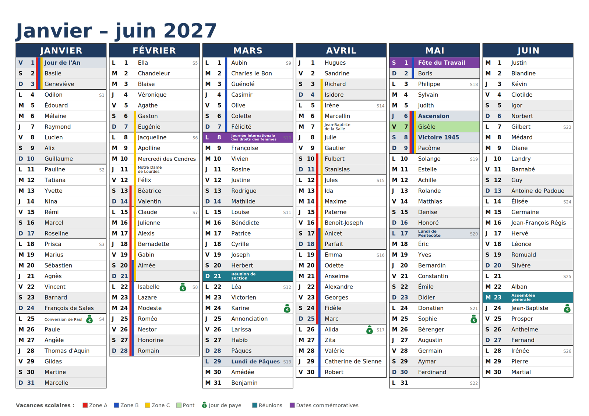
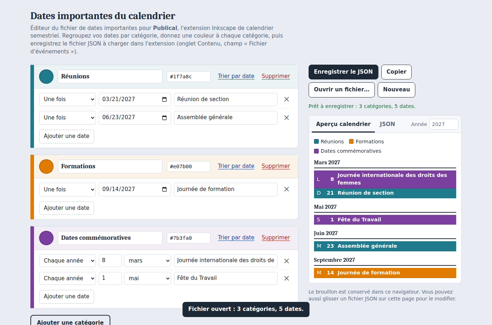

# Publical — générateur de calendrier semestriel (extension Inkscape)

**Publical** est une extension Inkscape qui génère un calendrier de bureau
semestriel (janvier–juin, juillet–décembre), du type **sous-main publicitaire** :
le format traditionnellement distribué comme objet promotionnel, avec les mois
en colonnes et une ligne par jour — plutôt qu'une grille de mois. Chaque ligne
affiche l'initiale du jour, la date, et la fête du jour, un jour férié, une
date importante ou un espace libre pour une note.

**Publical est spécifiquement conçu pour la France** : jours fériés, fêtes du
jour (saints) et zones de vacances scolaires (A, B, C) suivent tous le
calendrier français. L'interface et le calendrier généré sont en français.



## Fonctionnalités

- **Deux pages** (ou deux calques), une par semestre, générées en un clic.
- **Jours fériés** et **Pâques** calculés automatiquement pour n'importe
  quelle année (métropole, hors Alsace-Moselle).
- **Fêtes du jour (saints)**, activables ou non.
- **Vacances scolaires** des zones A, B et C, en barres de couleur, avec le
  pont de l'Ascension ; dates 2026 à 2028 préremplies.
- **Ponts d'entreprise** : un jour travaillé isolé entre un jour férié et un
  jour non travaillé (le lundi avant un férié du mardi, par exemple) est
  repéré et coloré automatiquement, quels que soient les jours travaillés.
- **Jours de paye** : pictogramme sur une date fixe du mois, ou sur le
  N-ième dernier jour ouvré (« 5 jours ouvrés avant la fin du mois »).
- **Dates importantes par catégories colorées**, via un fichier JSON
  (assemblées générales, formations, dates commémoratives…). Voir
  [le format du fichier](#fichier-devénements-json) plus bas.
- **Apparence** : format A3 à A6, portrait ou paysage, couleurs, police,
  bordure des colonnes facultative, colonnes toujours sur fond blanc (la
  couleur de fond du document reste libre).

## Installation

1. Téléchargez ce dépôt (bouton **Code → Download ZIP**, ou `git clone`).
2. Copiez les trois fichiers suivants **ensemble, dans le même dossier**,
   dans le dossier des extensions utilisateur d'Inkscape :
   - `publical.inx`
   - `publical.py`
   - `publical_inkscape.py`

   Le dossier des extensions utilisateur se trouve, par défaut :

   | Système | Dossier |
   |---|---|
   | Linux | `~/.config/inkscape/extensions` |
   | Windows | `%APPDATA%\inkscape\extensions` |
   | macOS | `~/Library/Application Support/org.inkscape.Inkscape/config/inkscape/extensions` |

   Le chemin exact est indiqué dans **Édition → Préférences → Système**
   (« Extensions utilisateur »).
3. Redémarrez Inkscape.
4. Lancez **Extensions → Rendu → Publical — Calendrier semestriel (FR)**
   (« Render » si Inkscape est en anglais).

Testé dans l'application Inkscape avec les versions 1.4.3 et 1.4.4. La
disposition « deux pages » demande Inkscape 1.2 ou plus ; en deçà, utilisez
l'option « deux calques ».

## Utilisation en ligne de commande

Le fichier `publical.py` fonctionne aussi seul, sans Inkscape, avec
Python 3.8 ou plus, sans aucune dépendance externe :

```bash
python3 publical.py                     # mode questions/réponses
python3 publical.py 2027                # avec les valeurs par défaut
python3 publical.py 2027 --format A3 --couleur bleu --zones ABC --ponts --paye fin
python3 publical.py --help              # liste complète des options
```

Il écrit deux fichiers SVG (un par semestre), à ouvrir dans Inkscape ou à
convertir en PDF : `inkscape calendrier_2027_S1.svg --export-type=pdf`.

## Fichier d'événements (JSON)

Pour ajouter des dates importantes par catégories colorées, passez un
fichier JSON en argument (`--evenements fichier.json` en ligne de commande,
ou dans l'onglet **Contenu** de la boîte de dialogue). Un exemple est fourni
dans [`exemples/evenements_exemple.json`](exemples/evenements_exemple.json).

```json
{
  "Réunions": {
    "couleur": "#1f7a8c",
    "dates": {
      "2027-03-21": "Réunion de section",
      "2027-06-23": "Assemblée générale"
    }
  },
  "Dates commémoratives": {
    "couleur": "#7b3fa0",
    "dates": {
      "03-08": "Journée internationale des droits des femmes"
    }
  }
}
```

- Le nom des catégories est entièrement libre.
- `couleur` est facultative : sans elle, une couleur est attribuée
  automatiquement. Elle s'écrit en hexadécimal (`#7b3fa0`) ou par nom
  (rouge, bleu, vert, orange, violet, gris, noir).
- Une date au format `AAAA-MM-JJ` ne compte qu'une fois (ex. `2027-06-23`) ;
  au format `MM-JJ`, elle revient chaque année (ex. `03-08`).
- Un format simple, sans catégorie, est aussi accepté :
  `{"2027-03-15": "Texte"}`.

### Éditeur de fichier JSON

[`outils/editeur_evenements.html`](outils/editeur_evenements.html) est une
page autonome (HTML/CSS/JS) pour créer ou modifier ce fichier sans écrire de
JSON à la main : elle s'ouvre en double-cliquant dessus, dans n'importe quel
navigateur, sans connexion ni installation. Elle permet de créer des
catégories, choisir leur couleur (sélecteur ou code hexadécimal), saisir les
dates, prévisualiser le résultat sous forme de calendrier, puis d'enregistrer
ou copier le fichier JSON.



## Arborescence du dépôt

```
publical.inx                        # description de l'extension pour Inkscape
publical.py                         # génération du calendrier (SVG), utilisable seul
publical_inkscape.py                # fait le lien entre Inkscape et publical.py
exemples/evenements_exemple.json    # exemple de fichier de dates importantes
outils/editeur_evenements.html      # éditeur autonome du fichier JSON
captures/                           # images utilisées par ce README
```

## Sources et limites

- Jours fériés et Pâques : calculés (algorithme de Meeus/Jones/Butcher pour
  Pâques). Métropole uniquement, hors Alsace-Moselle.
- Vacances scolaires : dates 2026-2027 et 2027-2028 d'après
  [Service-Public.fr](https://www.service-public.fr/particuliers/vosdroits/F31952)
  (arrêtés du 22 octobre 2025 et du 21 juillet 2026), à vérifier avant
  impression et à compléter pour les années suivantes. Zones A, B, C
  uniquement (pas la Corse ni l'outre-mer).
- Fêtes du jour (saints) : d'après le projet
  [theofidry/ephemeris](https://github.com/theofidry/ephemeris), avec
  quelques corrections. À relire avant impression.

## Fonctionnement hors ligne et confidentialité

Publical ne se connecte à aucun serveur, ne collecte aucune donnée et ne
modifie rien en dehors du document Inkscape ouvert et des fichiers que vous
lui demandez explicitement de lire ou écrire (le fichier d'événements JSON et
les calendriers SVG générés). Le calcul des jours fériés, de Pâques et des
jours de paye est entièrement local ; les dates de vacances scolaires sont
intégrées au script (pas de requête réseau).

## Licence

Publié sous licence [GNU GPL v3](LICENSE). Vous pouvez librement utiliser,
modifier et redistribuer ce code, à condition de conserver la même licence
et de mentionner les modifications apportées.

Copyright (C) 2026 Thomas GARNIER.
